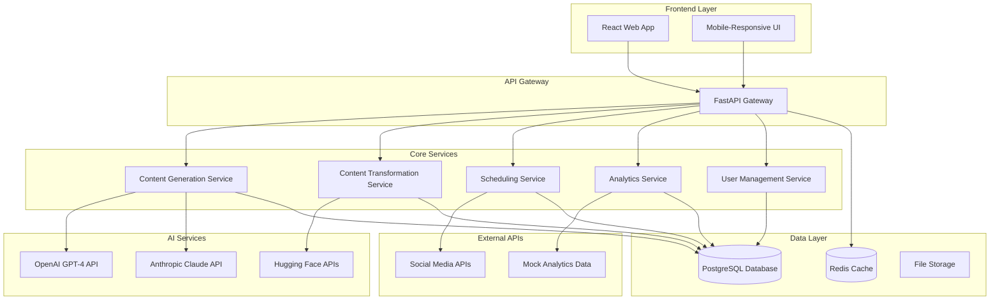
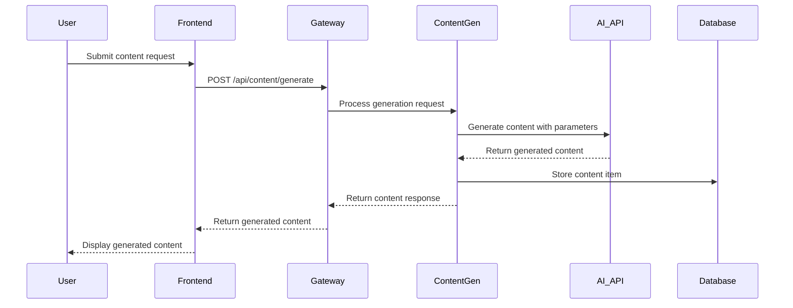
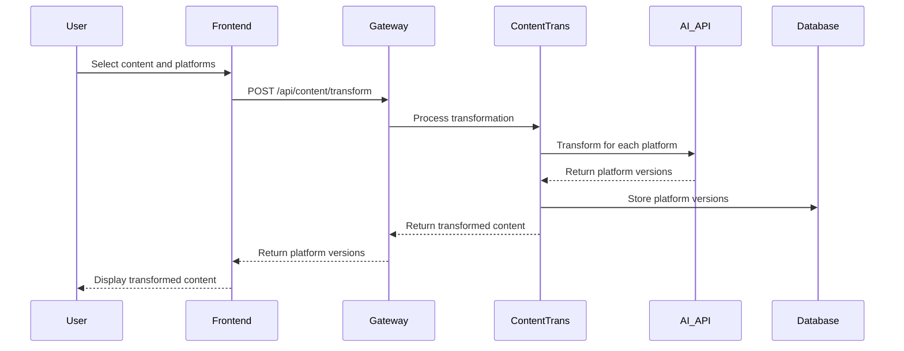
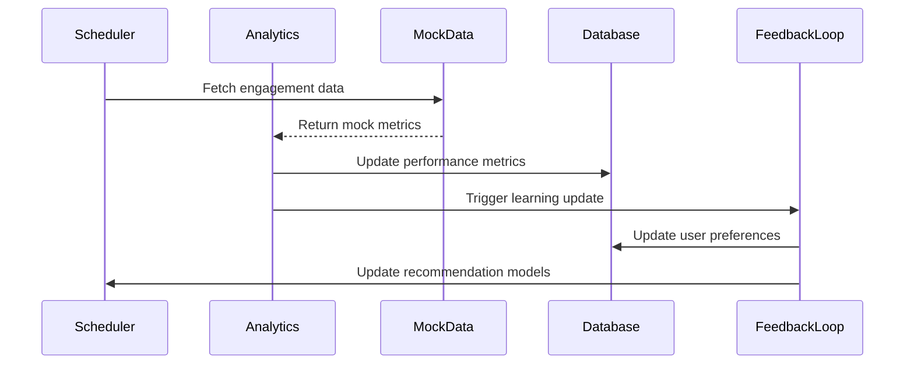

# Design Document: Content Co-Pilot

## Overview

The Content Co-Pilot is an AI-powered platform designed for hackathon rapid prototyping that assists users across the entire content lifecycle. The system leverages third-party AI APIs for content generation and transformation, implements intelligent scheduling recommendations, and provides performance analytics with actionable insights.

The platform follows a microservices architecture with a React frontend, FastAPI backend, and integration with multiple AI services. The design prioritizes rapid development, demonstrable features, and scalability for hackathon constraints while maintaining a clear path for future production deployment.

## Architecture

### High-Level System Architecture



### Component-Level Architecture

#### Frontend Components
- **Dashboard**: Main user interface with content overview and quick actions
- **Content Generator**: Form-based interface for AI content creation
- **Content Transformer**: Multi-platform content adaptation interface
- **Content Calendar**: Visual scheduling and planning interface
- **Analytics Dashboard**: Performance metrics and insights visualization
- **Content Library**: Searchable repository with tagging system

#### Backend Services
- **API Gateway**: Request routing, authentication, rate limiting
- **Content Generation Service**: AI content creation orchestration
- **Content Transformation Service**: Platform-specific content adaptation
- **Scheduling Service**: Optimal timing and platform recommendations
- **Analytics Service**: Performance analysis and insight generation
- **User Management Service**: Authentication, profiles, and preferences

## Data Models

### Core Data Structures

```python
# User Model
class User:
    id: UUID
    email: str
    username: str
    password_hash: str
    profile: UserProfile
    preferences: UserPreferences
    created_at: datetime
    updated_at: datetime

# User Profile
class UserProfile:
    user_id: UUID
    target_audience: str
    content_goals: List[str]
    preferred_tone: str
    industry: str
    social_accounts: List[SocialAccount]

# Content Item
class ContentItem:
    id: UUID
    user_id: UUID
    title: str
    content: str
    content_type: ContentType
    platform_versions: List[PlatformVersion]
    tags: List[str]
    category: ContentCategory
    status: ContentStatus
    performance_metrics: PerformanceMetrics
    created_at: datetime
    updated_at: datetime

# Platform Version
class PlatformVersion:
    id: UUID
    content_item_id: UUID
    platform: Platform
    adapted_content: str
    character_count: int
    hashtags: List[str]
    scheduled_time: Optional[datetime]
    published_time: Optional[datetime]
    engagement_metrics: EngagementMetrics

# Performance Metrics
class PerformanceMetrics:
    content_item_id: UUID
    total_views: int
    total_likes: int
    total_comments: int
    total_shares: int
    engagement_rate: float
    platform_breakdown: Dict[Platform, EngagementMetrics]
    last_updated: datetime

# Scheduling Recommendation
class SchedulingRecommendation:
    id: UUID
    user_id: UUID
    content_type: ContentType
    recommended_platforms: List[Platform]
    optimal_times: List[datetime]
    reasoning: str
    confidence_score: float
    created_at: datetime
```

### Database Schema Design

```sql
-- Users table
CREATE TABLE users (
    id UUID PRIMARY KEY DEFAULT gen_random_uuid(),
    email VARCHAR(255) UNIQUE NOT NULL,
    username VARCHAR(100) UNIQUE NOT NULL,
    password_hash VARCHAR(255) NOT NULL,
    created_at TIMESTAMP DEFAULT CURRENT_TIMESTAMP,
    updated_at TIMESTAMP DEFAULT CURRENT_TIMESTAMP
);

-- User profiles table
CREATE TABLE user_profiles (
    id UUID PRIMARY KEY DEFAULT gen_random_uuid(),
    user_id UUID REFERENCES users(id) ON DELETE CASCADE,
    target_audience TEXT,
    content_goals JSONB,
    preferred_tone VARCHAR(50),
    industry VARCHAR(100),
    social_accounts JSONB
);

-- Content items table
CREATE TABLE content_items (
    id UUID PRIMARY KEY DEFAULT gen_random_uuid(),
    user_id UUID REFERENCES users(id) ON DELETE CASCADE,
    title VARCHAR(255) NOT NULL,
    content TEXT NOT NULL,
    content_type VARCHAR(50) NOT NULL,
    tags JSONB,
    category VARCHAR(50),
    status VARCHAR(50) DEFAULT 'draft',
    created_at TIMESTAMP DEFAULT CURRENT_TIMESTAMP,
    updated_at TIMESTAMP DEFAULT CURRENT_TIMESTAMP
);

-- Platform versions table
CREATE TABLE platform_versions (
    id UUID PRIMARY KEY DEFAULT gen_random_uuid(),
    content_item_id UUID REFERENCES content_items(id) ON DELETE CASCADE,
    platform VARCHAR(50) NOT NULL,
    adapted_content TEXT NOT NULL,
    character_count INTEGER,
    hashtags JSONB,
    scheduled_time TIMESTAMP,
    published_time TIMESTAMP
);

-- Performance metrics table
CREATE TABLE performance_metrics (
    id UUID PRIMARY KEY DEFAULT gen_random_uuid(),
    content_item_id UUID REFERENCES content_items(id) ON DELETE CASCADE,
    platform VARCHAR(50) NOT NULL,
    views INTEGER DEFAULT 0,
    likes INTEGER DEFAULT 0,
    comments INTEGER DEFAULT 0,
    shares INTEGER DEFAULT 0,
    engagement_rate DECIMAL(5,4) DEFAULT 0,
    last_updated TIMESTAMP DEFAULT CURRENT_TIMESTAMP
);
```

## Data Flow

### Content Generation Flow



### Content Transformation Flow



### Analytics and Feedback Loop



## AI & ML Design

### Content Generation Pipeline

**Primary AI Services Integration:**
- **OpenAI GPT-4**: Primary content generation for long-form content
- **Anthropic Claude**: Alternative content generation with safety focus
- **Hugging Face Models**: Specialized tasks like sentiment analysis and classification

**Content Generation Strategy:**
```python
class ContentGenerationPipeline:
    def __init__(self):
        self.primary_model = OpenAIClient()
        self.fallback_model = ClaudeClient()
        self.classifier = HuggingFaceClassifier()
    
    async def generate_content(self, prompt: ContentPrompt) -> GeneratedContent:
        # Classify content type and select appropriate model
        content_type = await self.classifier.classify_intent(prompt.topic)
        
        # Generate with primary model
        try:
            content = await self.primary_model.generate(
                prompt=self._build_prompt(prompt),
                max_tokens=self._calculate_tokens(prompt.content_type),
                temperature=self._get_temperature(prompt.tone)
            )
        except Exception:
            # Fallback to secondary model
            content = await self.fallback_model.generate(prompt)
        
        return self._post_process(content, prompt)
```

### Content Transformation Engine

**Platform-Specific Adaptation:**
```python
class PlatformTransformer:
    PLATFORM_CONFIGS = {
        'twitter': {'max_chars': 280, 'hashtag_limit': 2},
        'linkedin': {'max_chars': 3000, 'professional_tone': True},
        'instagram': {'max_chars': 2200, 'visual_focus': True},
        'facebook': {'max_chars': 63206, 'engagement_focus': True}
    }
    
    async def transform_content(self, content: str, target_platform: str) -> str:
        config = self.PLATFORM_CONFIGS[target_platform]
        
        transformation_prompt = f"""
        Transform this content for {target_platform}:
        Original: {content}
        
        Requirements:
        - Max characters: {config['max_chars']}
        - Platform style: {self._get_platform_style(target_platform)}
        - Maintain core message while adapting tone and format
        """
        
        return await self.ai_client.transform(transformation_prompt)
```

### Recommendation System

**Scheduling Intelligence:**
```python
class SchedulingRecommendationEngine:
    def __init__(self):
        self.user_behavior_model = UserBehaviorModel()
        self.platform_analytics = PlatformAnalytics()
        self.content_classifier = ContentClassifier()
    
    async def recommend_schedule(self, user_id: UUID, content: ContentItem) -> SchedulingRecommendation:
        # Analyze user's historical performance
        user_patterns = await self.user_behavior_model.get_patterns(user_id)
        
        # Get platform-specific optimal times
        platform_times = await self.platform_analytics.get_optimal_times(
            content_type=content.content_type,
            target_audience=user_patterns.audience_demographics
        )
        
        # Generate recommendations
        return SchedulingRecommendation(
            recommended_platforms=self._rank_platforms(content, user_patterns),
            optimal_times=platform_times,
            reasoning=self._generate_reasoning(content, user_patterns),
            confidence_score=self._calculate_confidence(user_patterns)
        )
```

## API Design

### Core API Endpoints

```python
# Content Generation Endpoints
@app.post("/api/content/generate")
async def generate_content(request: ContentGenerationRequest) -> ContentResponse:
    """Generate AI content based on topic, audience, and tone"""

@app.post("/api/content/transform")
async def transform_content(request: TransformationRequest) -> TransformationResponse:
    """Transform content for multiple platforms"""

@app.get("/api/content/{content_id}/variations")
async def get_content_variations(content_id: UUID) -> List[ContentVariation]:
    """Get all platform variations of a content item"""

# Scheduling Endpoints
@app.post("/api/schedule/recommend")
async def recommend_schedule(request: ScheduleRequest) -> SchedulingRecommendation:
    """Get AI-powered scheduling recommendations"""

@app.post("/api/schedule/content")
async def schedule_content(request: ScheduleContentRequest) -> ScheduleResponse:
    """Schedule content for specific platforms and times"""

# Analytics Endpoints
@app.get("/api/analytics/dashboard/{user_id}")
async def get_analytics_dashboard(user_id: UUID) -> AnalyticsDashboard:
    """Get comprehensive analytics dashboard"""

@app.get("/api/analytics/insights/{content_id}")
async def get_content_insights(content_id: UUID) -> ContentInsights:
    """Get detailed insights for specific content"""

# Content Management Endpoints
@app.get("/api/content/library")
async def get_content_library(user_id: UUID, filters: ContentFilters) -> ContentLibrary:
    """Get user's content library with search and filtering"""

@app.post("/api/content/tag")
async def tag_content(request: TaggingRequest) -> TaggingResponse:
    """Auto-tag content with AI-generated tags"""
```

### API Request/Response Models

```python
# Request Models
class ContentGenerationRequest(BaseModel):
    topic: str
    target_audience: str
    tone: str
    content_type: str
    length: Optional[str] = "medium"
    keywords: Optional[List[str]] = []

class TransformationRequest(BaseModel):
    content_id: UUID
    target_platforms: List[str]
    preserve_hashtags: bool = True
    custom_instructions: Optional[str] = None

# Response Models
class ContentResponse(BaseModel):
    content_id: UUID
    generated_content: str
    metadata: ContentMetadata
    suggestions: List[str]
    estimated_engagement: EngagementPrediction

class SchedulingRecommendation(BaseModel):
    recommended_platforms: List[PlatformRecommendation]
    optimal_times: List[TimeSlot]
    reasoning: str
    confidence_score: float
    alternative_options: List[AlternativeSchedule]
```

## Technology Stack

### Frontend Stack
- **React 18**: Modern UI framework with hooks and concurrent features
- **Vite**: Fast build tool and development server
- **TypeScript**: Type safety and better developer experience
- **Tailwind CSS**: Utility-first CSS framework for rapid styling
- **React Query**: Data fetching and caching
- **React Router**: Client-side routing
- **Chart.js**: Analytics visualization
- **React Hook Form**: Form handling and validation

### Backend Stack
- **FastAPI**: High-performance Python web framework
- **Python 3.11+**: Latest Python features and performance improvements
- **Pydantic**: Data validation and serialization
- **SQLAlchemy**: ORM for database operations
- **Alembic**: Database migrations
- **Redis**: Caching and session storage
- **Celery**: Background task processing
- **Uvicorn**: ASGI server for FastAPI

### Database and Storage
- **PostgreSQL**: Primary relational database
- **Redis**: Caching and real-time data
- **AWS S3 / Local Storage**: File and media storage
- **Database Connection Pooling**: Efficient connection management

### AI and External Services
- **OpenAI API**: GPT-4 for content generation
- **Anthropic Claude API**: Alternative content generation
- **Hugging Face APIs**: Specialized NLP tasks
- **Mock Social Media APIs**: Simulated platform integrations
- **Mock Analytics Data**: Simulated engagement metrics

### Development and Deployment
- **Docker**: Containerization for consistent environments
- **Docker Compose**: Multi-service development setup
- **pytest**: Python testing framework
- **Jest**: JavaScript testing framework
- **GitHub Actions**: CI/CD pipeline
- **Environment Configuration**: Separate dev/staging/prod configs

## Security & Privacy Considerations

### Data Protection
- **Encryption**: All user data encrypted at rest using AES-256
- **Transport Security**: HTTPS/TLS 1.3 for all communications
- **API Security**: JWT tokens with refresh token rotation
- **Input Validation**: Comprehensive validation using Pydantic models
- **SQL Injection Prevention**: Parameterized queries via SQLAlchemy ORM

### Privacy Measures
- **Data Minimization**: Collect only necessary user information
- **Consent Management**: Clear opt-in for data processing
- **Right to Deletion**: User data deletion capabilities
- **Data Portability**: Export functionality for user data
- **Third-party AI Privacy**: Content anonymization before AI processing

### Authentication and Authorization
```python
class SecurityConfig:
    JWT_SECRET_KEY = os.getenv("JWT_SECRET_KEY")
    JWT_ALGORITHM = "HS256"
    ACCESS_TOKEN_EXPIRE_MINUTES = 30
    REFRESH_TOKEN_EXPIRE_DAYS = 7
    
    # Rate limiting
    RATE_LIMIT_PER_MINUTE = 60
    AI_GENERATION_LIMIT_PER_HOUR = 100
    
    # Content filtering
    CONTENT_MODERATION_ENABLED = True
    PROFANITY_FILTER_ENABLED = True
```

### Hackathon Security Adaptations
- **Simplified Authentication**: Basic JWT without complex OAuth flows
- **Mock Data Security**: Ensure mock data doesn't contain real user information
- **API Key Management**: Secure storage of third-party API keys
- **Development Mode**: Clear separation between dev and production security

## Scalability & Performance Considerations

### Performance Optimization
- **Caching Strategy**: Multi-level caching with Redis
- **Database Optimization**: Proper indexing and query optimization
- **API Response Caching**: Cache frequently requested data
- **Lazy Loading**: Load content and analytics on demand
- **Connection Pooling**: Efficient database connection management

### Scalability Design
```python
# Caching Strategy
class CacheManager:
    def __init__(self):
        self.redis_client = Redis()
        self.cache_ttl = {
            'user_preferences': 3600,  # 1 hour
            'content_recommendations': 1800,  # 30 minutes
            'analytics_data': 300,  # 5 minutes
            'ai_responses': 7200  # 2 hours
        }
    
    async def get_or_generate(self, key: str, generator_func, ttl: int):
        cached = await self.redis_client.get(key)
        if cached:
            return json.loads(cached)
        
        result = await generator_func()
        await self.redis_client.setex(key, ttl, json.dumps(result))
        return result
```

### Hackathon Performance Considerations
- **Mock Data Performance**: Pre-generated mock datasets for fast responses
- **AI API Optimization**: Implement request batching and caching
- **Frontend Optimization**: Code splitting and lazy loading
- **Database Seeding**: Pre-populated database for demo purposes

## Error Handling

### Comprehensive Error Management
```python
class ContentCoilotException(Exception):
    """Base exception for Content Co-Pilot"""
    pass

class AIServiceException(ContentCoilotException):
    """AI service related errors"""
    pass

class ContentGenerationException(AIServiceException):
    """Content generation specific errors"""
    pass

# Global error handler
@app.exception_handler(ContentCoilotException)
async def content_copilot_exception_handler(request: Request, exc: ContentCoilotException):
    return JSONResponse(
        status_code=400,
        content={
            "error": exc.__class__.__name__,
            "message": str(exc),
            "timestamp": datetime.utcnow().isoformat(),
            "path": request.url.path
        }
    )

# AI service error handling with fallbacks
class AIServiceManager:
    async def generate_with_fallback(self, prompt: str) -> str:
        try:
            return await self.primary_ai_service.generate(prompt)
        except AIServiceException:
            try:
                return await self.secondary_ai_service.generate(prompt)
            except AIServiceException:
                return await self.fallback_template_service.generate(prompt)
```

## Testing Strategy

The Content Co-Pilot platform requires comprehensive testing to ensure reliability and correctness across all components. Our testing approach combines unit tests for specific functionality with property-based tests for universal system behaviors.

### Dual Testing Approach

**Unit Tests**: Focus on specific examples, edge cases, and integration points between components. Unit tests validate concrete scenarios and error conditions, ensuring individual components work correctly in isolation.

**Property-Based Tests**: Verify universal properties that should hold across all valid inputs. These tests use randomized input generation to discover edge cases and validate system-wide correctness properties.

### Property-Based Testing Configuration

All property-based tests will use the **Hypothesis** library for Python backend testing and **fast-check** for TypeScript frontend testing. Each property test must:
- Run a minimum of 100 iterations to ensure comprehensive input coverage
- Reference the specific design document property being validated
- Use the tag format: **Feature: content-co-pilot, Property {number}: {property_text}**

### Testing Coverage Areas

**AI Integration Testing**:
- Unit tests for API integration error handling and response parsing
- Property tests for content generation consistency and quality
- Mock service testing for development and CI environments

**Content Management Testing**:
- Unit tests for CRUD operations and data validation
- Property tests for content transformation and platform adaptation
- Integration tests for database operations and caching

**User Interface Testing**:
- Unit tests for component rendering and user interactions
- Property tests for form validation and data flow
- End-to-end tests for critical user workflows

**Performance and Security Testing**:
- Unit tests for authentication and authorization flows
- Property tests for rate limiting and input validation
- Load testing for concurrent user scenarios (hackathon scale)

Now I need to use the prework tool to analyze the acceptance criteria before writing the Correctness Properties section.

<function_calls>
<invoke name="prework">
<parameter name="featureName">content-co-pilot

## Correctness Properties

*A property is a characteristic or behavior that should hold true across all valid executions of a system—essentially, a formal statement about what the system should do. Properties serve as the bridge between human-readable specifications and machine-verifiable correctness guarantees.*

Based on the prework analysis of our acceptance criteria, the following properties capture the essential correctness requirements for the Content Co-Pilot platform:

### Content Generation Properties

**Property 1: Tone Consistency**
*For any* content generation request with a specified tone, the generated content should maintain that tone consistently throughout the entire draft
**Validates: Requirements 1.2**

**Property 2: Content Variation Distinctness**
*For any* content generation request asking for multiple variations, the system should produce at least 3 variations that are measurably distinct from each other
**Validates: Requirements 1.3**

**Property 3: Invalid Input Error Handling**
*For any* empty or invalid topic input, the Content_Generator should return a descriptive error message rather than generating content
**Validates: Requirements 1.4**

### Content Transformation Properties

**Property 4: Platform-Specific Content Generation**
*For any* source content and selected target platforms, the Content_Transformer should generate platform-optimized versions for each requested platform
**Validates: Requirements 2.1**

**Property 5: Platform Constraint Compliance**
*For any* transformed content, the output should respect the character limits and formatting requirements specific to each target platform
**Validates: Requirements 2.2**

**Property 6: Semantic Preservation During Transformation**
*For any* content transformation, the core message and meaning should be preserved while adapting style and length for the target platform
**Validates: Requirements 2.3**

**Property 7: Transformation Capability Error Guidance**
*For any* source content that exceeds transformation capabilities, the system should provide specific guidance on content reduction rather than failing silently
**Validates: Requirements 2.5**

### Scheduling and Recommendation Properties

**Property 8: Audience-Based Scheduling Recommendations**
*For any* user with audience data, scheduling recommendations should vary appropriately based on the audience demographics and behavior patterns
**Validates: Requirements 3.1**

**Property 9: Goal-Aligned Content Type Recommendations**
*For any* user goals and audience preferences, the recommended content types should align with achieving those specific goals
**Validates: Requirements 3.2**

**Property 10: Multi-Factor Platform Recommendations**
*For any* content item, platform recommendations should consider both content format compatibility and audience overlap across platforms
**Validates: Requirements 3.3**

**Property 11: Weekly Calendar Completeness**
*For any* weekly content calendar request, the system should generate at least 7 distinct content suggestions with appropriate scheduling
**Validates: Requirements 3.4**

**Property 12: Fallback Recommendation Availability**
*For any* user with insufficient historical data, the system should provide reasonable recommendations based on industry best practices
**Validates: Requirements 3.5**

### Analytics and Performance Properties

**Property 13: Engagement Metrics Calculation**
*For any* content performance data, the Analytics_Engine should correctly calculate engagement rates and identify trends based on the provided metrics
**Validates: Requirements 4.1**

**Property 14: Performance Pattern Recognition**
*For any* collection of content performance data, the system should identify characteristics and patterns that correlate with high performance
**Validates: Requirements 4.2**

**Property 15: Cross-Platform Performance Comparison**
*For any* content published across multiple platforms, the analytics should provide accurate comparisons of performance metrics between platforms and content types
**Validates: Requirements 4.4**

### Content Management and Tagging Properties

**Property 16: Automatic Tag Generation**
*For any* content created or uploaded, the system should automatically generate relevant tags that accurately reflect the content's topics and themes
**Validates: Requirements 5.1**

**Property 17: Content Classification Accuracy**
*For any* content item, the system should classify it into appropriate predefined categories (educational, promotional, entertainment, news) based on its content and purpose
**Validates: Requirements 5.2**

**Property 18: Topic and Theme Extraction**
*For any* content with identifiable topics and themes, the tagging system should accurately extract and represent these key elements as searchable tags
**Validates: Requirements 5.3**

**Property 19: Tag Customization Functionality**
*For any* automatically generated tags, users should be able to edit, add, or remove tags, and these changes should be properly saved and reflected in the system
**Validates: Requirements 5.4**

**Property 20: Content Library Search and Organization**
*For any* content library with tagged items, search functionality should return relevant results based on tags and categories, maintaining proper organization
**Validates: Requirements 5.5**

### Feedback Loop and Learning Properties

**Property 21: Performance-Based Preference Updates**
*For any* content performance data collected, the Feedback_Loop should update user preference models to reflect patterns in successful content
**Validates: Requirements 6.1**

**Property 22: Feedback Integration into Recommendations**
*For any* explicit user feedback provided, the system should incorporate these ratings into future recommendation algorithms, affecting subsequent suggestions
**Validates: Requirements 6.3**

**Property 23: Adaptive Scheduling Based on Engagement**
*For any* actual engagement outcomes, the scheduling recommendations should adapt to reflect what times and platforms actually perform well for the user
**Validates: Requirements 6.4**

**Property 24: Privacy-Compliant Preference Management**
*For any* user preference history, the system should maintain this data while respecting user privacy settings and allowing appropriate data control
**Validates: Requirements 6.5**

### User Management and Security Properties

**Property 25: Secure Account Creation**
*For any* user registration, the system should create accounts with properly hashed and encrypted password storage, never storing passwords in plain text
**Validates: Requirements 7.1**

**Property 26: Profile Customization Functionality**
*For any* user profile updates including audience demographics and content goals, the changes should be properly saved and reflected throughout the system
**Validates: Requirements 7.2**

**Property 27: Authentication and Session Management**
*For any* user login attempt, the system should properly authenticate credentials and maintain secure sessions with appropriate timeout and security measures
**Validates: Requirements 7.3**

**Property 28: Data Portability and Deletion**
*For any* user data export or account deletion request, the system should provide complete data export capabilities and properly remove all user data upon deletion
**Validates: Requirements 7.4**

**Property 29: Role-Based Access Control**
*For any* user with assigned roles, the system should enforce appropriate access permissions for team collaboration features based on those roles
**Validates: Requirements 7.5**

### System Performance and Load Management Properties

**Property 30: High Load Request Queuing**
*For any* system experiencing high load, requests should be properly queued and users should receive notifications about expected wait times rather than experiencing failures
**Validates: Requirements 8.4**

### Data Security and Privacy Properties

**Property 31: Comprehensive Data Encryption**
*For any* user data stored or transmitted, the system should implement proper encryption both in transit and at rest using industry-standard methods
**Validates: Requirements 9.1**

**Property 32: Consent-Based Data Sharing**
*For any* user content, the system should not share data with third parties without explicit user consent, and consent mechanisms should function correctly
**Validates: Requirements 9.2**

**Property 33: Privacy-Preserving AI Processing**
*For any* content processed through AI services, the system should implement privacy-preserving methods to protect user data during external processing
**Validates: Requirements 9.3**

**Property 34: Privacy Control Availability**
*For any* user, clear privacy controls and data usage transparency features should be available and functional within the system interface
**Validates: Requirements 9.4**

### API and Integration Properties

**Property 35: RESTful API Completeness**
*For any* core system functionality, corresponding RESTful API endpoints should exist and follow proper REST principles and conventions
**Validates: Requirements 10.1**

**Property 36: Webhook Integration Functionality**
*For any* configured webhook integration, the system should properly trigger webhooks for relevant events and handle webhook responses appropriately
**Validates: Requirements 10.2**

**Property 37: Consistent JSON API Responses**
*For any* API request made to the system, responses should be returned in standard, well-formed JSON format with consistent structure and error handling
**Validates: Requirements 10.3**

**Property 38: API Security Implementation**
*For any* API access, the system should properly implement rate limiting and authentication mechanisms to prevent abuse and unauthorized access
**Validates: Requirements 10.4**

## Error Handling

### Comprehensive Error Management Strategy

The Content Co-Pilot platform implements a multi-layered error handling approach designed to provide graceful degradation and clear user feedback across all system components.

#### AI Service Error Handling

**Primary-Secondary-Fallback Pattern:**
```python
class AIServiceErrorHandler:
    async def generate_with_resilience(self, request: ContentRequest) -> ContentResponse:
        try:
            # Primary AI service (OpenAI GPT-4)
            return await self.openai_service.generate(request)
        except AIServiceException as e:
            logger.warning(f"Primary AI service failed: {e}")
            try:
                # Secondary AI service (Anthropic Claude)
                return await self.claude_service.generate(request)
            except AIServiceException as e:
                logger.error(f"Secondary AI service failed: {e}")
                # Fallback to template-based generation
                return await self.template_service.generate_fallback(request)
```

**Error Categories and Responses:**
- **Rate Limit Exceeded**: Queue request with estimated wait time
- **Content Policy Violation**: Return specific guidance on content modification
- **Service Unavailable**: Automatic fallback to alternative AI service
- **Invalid Input**: Detailed validation error with correction suggestions
- **Timeout**: Partial response with option to continue generation

#### Database and Data Layer Errors

**Transaction Management:**
```python
class DatabaseErrorHandler:
    async def execute_with_rollback(self, operation: Callable) -> Any:
        async with self.db_session.begin():
            try:
                result = await operation()
                await self.db_session.commit()
                return result
            except DatabaseException as e:
                await self.db_session.rollback()
                logger.error(f"Database operation failed: {e}")
                raise ContentCoilotException(f"Data operation failed: {str(e)}")
```

**Data Consistency Safeguards:**
- **Constraint Violations**: Clear error messages with field-specific guidance
- **Connection Failures**: Automatic retry with exponential backoff
- **Data Corruption**: Validation checks with recovery procedures
- **Migration Errors**: Rollback capabilities with data integrity verification

#### User Interface Error Handling

**Progressive Error Disclosure:**
- **Field-Level Validation**: Real-time feedback on form inputs
- **Network Errors**: Retry mechanisms with offline capability indicators
- **Loading States**: Progress indicators with timeout handling
- **Graceful Degradation**: Core functionality maintained during partial failures

#### External API Integration Errors

**Social Media API Failures:**
```python
class SocialMediaErrorHandler:
    async def post_with_retry(self, content: ContentItem, platform: str) -> PostResult:
        max_retries = 3
        for attempt in range(max_retries):
            try:
                return await self.platform_apis[platform].post(content)
            except PlatformAPIException as e:
                if e.is_retryable and attempt < max_retries - 1:
                    await asyncio.sleep(2 ** attempt)  # Exponential backoff
                    continue
                else:
                    return PostResult(
                        success=False,
                        error=f"Failed to post to {platform}: {e.message}",
                        retry_after=e.retry_after if hasattr(e, 'retry_after') else None
                    )
```

## Testing Strategy

The Content Co-Pilot platform employs a comprehensive dual testing approach that combines unit tests for specific scenarios with property-based tests for universal system behaviors. This strategy ensures both concrete functionality validation and broad correctness guarantees.

### Testing Framework Configuration

**Backend Testing Stack:**
- **Pytest**: Primary testing framework for Python backend
- **Hypothesis**: Property-based testing library for universal property validation
- **pytest-asyncio**: Async test support for FastAPI endpoints
- **pytest-mock**: Mocking capabilities for external service dependencies
- **Factory Boy**: Test data generation for consistent test scenarios

**Frontend Testing Stack:**
- **Jest**: JavaScript testing framework for React components
- **fast-check**: Property-based testing library for TypeScript/JavaScript
- **React Testing Library**: Component testing with user-centric approach
- **MSW (Mock Service Worker)**: API mocking for integration tests

### Property-Based Testing Implementation

Each property-based test must run a minimum of 100 iterations to ensure comprehensive input coverage through randomization. All property tests use the following tag format for traceability:

**Tag Format**: `# Feature: content-co-pilot, Property {number}: {property_text}`

**Example Property Test Implementation:**
```python
from hypothesis import given, strategies as st
import pytest

class TestContentGeneration:
    @given(
        topic=st.text(min_size=1, max_size=200),
        tone=st.sampled_from(['professional', 'casual', 'humorous', 'educational', 'inspirational']),
        audience=st.text(min_size=1, max_size=100)
    )
    @pytest.mark.property_test
    async def test_tone_consistency_property(self, topic, tone, audience):
        """
        Feature: content-co-pilot, Property 1: Tone Consistency
        For any content generation request with a specified tone, 
        the generated content should maintain that tone consistently throughout the entire draft
        """
        request = ContentGenerationRequest(
            topic=topic,
            tone=tone,
            target_audience=audience
        )
        
        response = await self.content_generator.generate(request)
        
        # Verify tone consistency using NLP analysis
        tone_analysis = await self.tone_analyzer.analyze(response.content)
        assert tone_analysis.primary_tone == tone
        assert tone_analysis.consistency_score > 0.8
```

### Unit Testing Strategy

Unit tests focus on specific examples, edge cases, and integration points between components. They complement property-based tests by validating concrete scenarios and error conditions.

**Testing Coverage Areas:**

**AI Integration Unit Tests:**
- Mock API responses for consistent testing
- Error handling for rate limits and service failures
- Response parsing and data validation
- Fallback service activation scenarios

**Content Management Unit Tests:**
- CRUD operations for content items
- Database constraint validation
- Cache invalidation scenarios
- File upload and storage operations

**User Authentication Unit Tests:**
- Password hashing and verification
- JWT token generation and validation
- Session management and expiration
- Role-based access control enforcement

**API Endpoint Unit Tests:**
- Request validation and error responses
- Response format consistency
- Rate limiting enforcement
- Authentication middleware functionality

### Integration Testing Approach

**Database Integration Tests:**
- Full database transaction scenarios
- Migration testing with sample data
- Connection pooling and performance validation
- Data consistency across service boundaries

**External Service Integration Tests:**
- Mock social media API interactions
- AI service integration with fallback testing
- Webhook delivery and retry mechanisms
- Third-party authentication flows

### Performance and Load Testing

**Hackathon-Scale Performance Testing:**
- Concurrent user simulation (up to 100 users)
- AI service response time validation
- Database query performance optimization
- Frontend rendering performance under load

**Caching and Optimization Testing:**
- Redis cache hit/miss ratio validation
- Database query optimization verification
- API response caching effectiveness
- Static asset delivery performance

### Test Data Management

**Mock Data Strategy:**
- Realistic but anonymized user profiles
- Diverse content samples across categories
- Simulated engagement metrics with realistic patterns
- Platform-specific content examples

**Test Environment Configuration:**
- Isolated test databases with seed data
- Mock AI service responses for consistent testing
- Simulated social media API responses
- Configurable test scenarios for different user types

This comprehensive testing strategy ensures the Content Co-Pilot platform maintains high quality and reliability while supporting rapid development cycles suitable for hackathon environments.